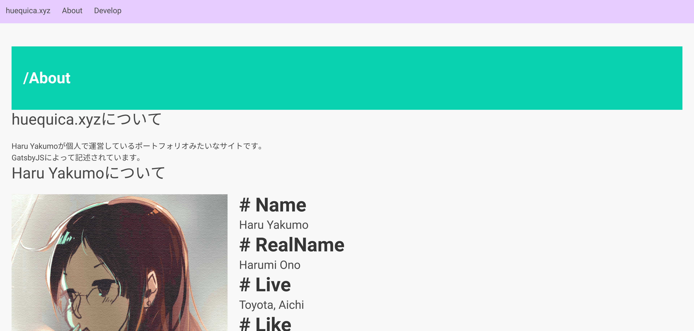
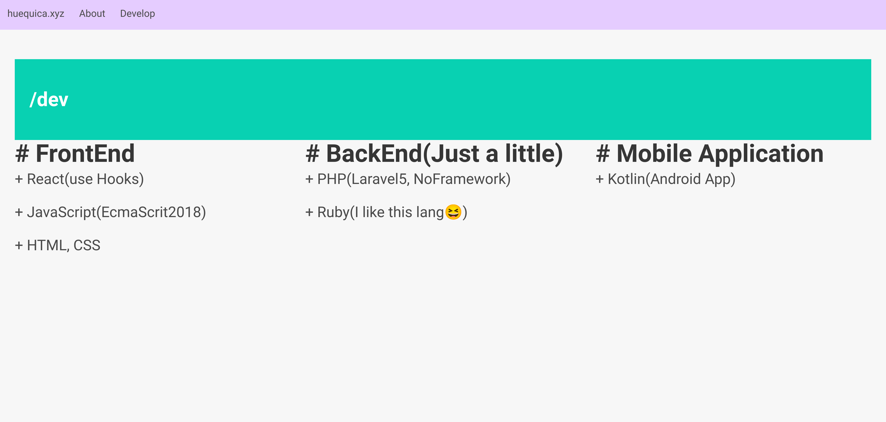

# Gatsbied_portfolio

New Portfolio site( **WIP** )

# Used Libraries

+ React
+ GatsbyJS

# Get started

1. `$ yarn`  
  Note: Please do not use `npm`

2. `$ yarn develop`

# Screenshots

## /about

## /dev

